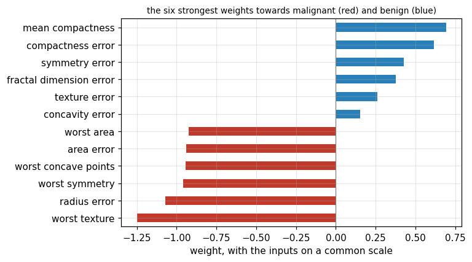
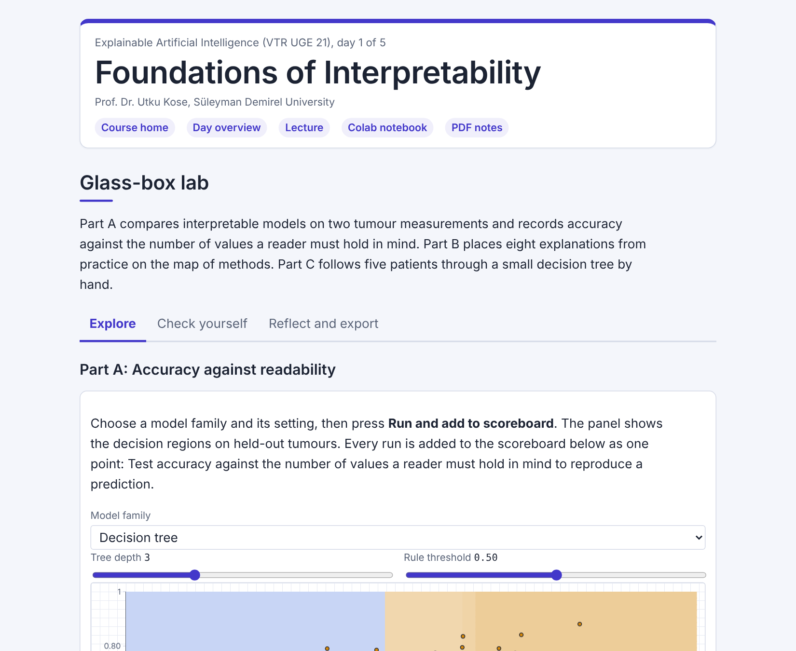

# Day 01: Foundations of Interpretability

**Explainable Artificial Intelligence (VTR UGE 21)**  
Prof. Dr. Utku Kose, Süleyman Demirel University

   

Why models need explanations, the map of explanation methods, models that explain themselves and a model that is accurate for the wrong reason. **Estimated study time:** 6 to 8 hours.

## Materials of the day

Each material has its own role. Start with the lecture page; the study path below gives the order and the time of each step.

| Material | What it holds | Open |
|---|---|---|
| Lecture page | The concepts of the day, with animations, an interactive scene, knowledge checks, review cards and the references | [Lecture page](https://utkukose.github.io/xai-veltech-NB-lecture/days/day-01/lecture.html) |
| Colab notebook | Python step 1: Values, variables, lists and decisions, then the hands-on sections with exercises, an application switch and the application challenges |  |
| Interactive lab | Glass-box lab: Six practice parts, a self-assessment and an exportable learning log | [Interactive lab](https://utkukose.github.io/xai-veltech-NB-lecture/days/day-01/lab.html) |
| PDF lecture notes | The lecture and the Python step in one printable file | [PDF notes](Day01_Lecture_Notes.pdf) |

<table><tr><td width="50%"> From the Colab notebook</td><td width="50%"> The interactive lab</td></tr></table>

## Learning outcomes

By the end of the day, students are expected to explain why accurate models still need explanations, to define interpretability and explainability, to place an explanation method on the map of global and local, built-in and post-hoc methods, to read a logistic regression and a decision tree, to discuss the trade-off between accuracy and readability, to name the properties of a good explanation and to recognise a model that learned a shortcut. In Python, students are expected to use values, variables, lists, decisions, functions and dictionaries.

## Study path

| Step | Activity | Suggested time |
|---|---|---|
| 1 | Read the [lecture page](https://utkukose.github.io/xai-veltech-NB-lecture/days/day-01/lecture.html) and answer its knowledge checks | 1 hour 30 minutes |
| 2 | Work through parts A to F of the [interactive lab](https://utkukose.github.io/xai-veltech-NB-lecture/days/day-01/lab.html) | 1 hour |
| 3 | Run Python step 1: Values, variables, lists and decisions in the [Colab notebook](https://colab.research.google.com/github/utkukose/xai-veltech-NB-lecture/blob/main/days/day-01/NB01_foundations_of_interpretability.ipynb#scrollTo=python-step), right after the setup cell | 1 hour |
| 4 | Work through the numbered sections of the notebook and their exercises | 2 hours |
| 5 | Use the application switch of the notebook and solve the application challenge of your field | 45 minutes |
| 6 | Take the self-assessment in the [interactive lab](https://utkukose.github.io/xai-veltech-NB-lecture/days/day-01/lab.html) (tab: Check yourself) | 20 minutes |
| 7 | Write the reflection in the lab, export the learning log and complete the daily task below | 45 minutes |

## Live session plan

The day runs as one synchronous session in class or online, and each material has one role in it. The lecture page is on the screen, and at each orange Colab box the instructor shows the matching section in a copy of the notebook that has already been run. Students work in their own copy of the notebook from top to bottom, and each lab part follows the lecture part it practises. The PDF lecture notes serve reading after the session, and the study path above serves self-paced study.

| Time | Activity |
|---|---|
| 0:00 to 0:15 | Opening: Would you accept a diagnosis that nobody can explain? A tour of the course page, then students open the notebook in Colab, save a copy in Drive and run section 0 |
| 0:15 to 0:50 | Lecture page, part 1: Why explain a model, interpretability and explainability, the map of methods; then lab Part B with the whole class |
| 0:50 to 1:15 | Colab, together: Python step 1, ending with a threshold rule for five patients |
| 1:15 to 1:25 | Break |
| 1:25 to 2:00 | Lecture page, part 2: Models that explain themselves with the tree animation, accuracy and readability, a good explanation with the local-slope animation, the shortcut; then lab Part C by hand |
| 2:00 to 2:40 | Colab, in pairs: Sections 1 to 6 with their exercises, then section 7 with a different field for each pair |
| 2:40 to 3:00 | Lab and closing: Part A on accuracy against readability, then the self-assessment; after the session: The PDF notes, the daily task and the optional section 8 |

## Daily task and submission

Choose a dataset from your field with a yes or no outcome. Fit a logistic regression and a decision tree of depth three, report their test accuracies, and write about 200 words on which of the two models you would show to a colleague in your field, and why.

The task is optional and supports self-learning and a personal portfolio. During an active delivery of the course, it can be sent together with the exported learning log to utkukose@sdu.edu.tr or utkukose@gmail.com.

## Research and report assignment (optional)

**Interpretable models or explained black boxes in a regulated domain.** Select one domain, such as credit scoring, medical triage or recruitment, and review published evidence on whether interpretable models are competitive there. Relate the findings to the position of Rudin &#91;[16](https://utkukose.github.io/xai-veltech-NB-lecture/days/day-01/lecture.html#ref-16)&#93; and to the definitional debate in &#91;[9](https://utkukose.github.io/xai-veltech-NB-lecture/days/day-01/lecture.html#ref-9)&#93;, and conclude with a recommendation for practice. The report should be about 1500 words with at least eight sources.
