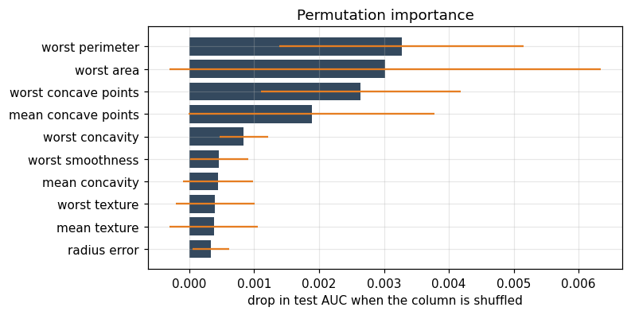
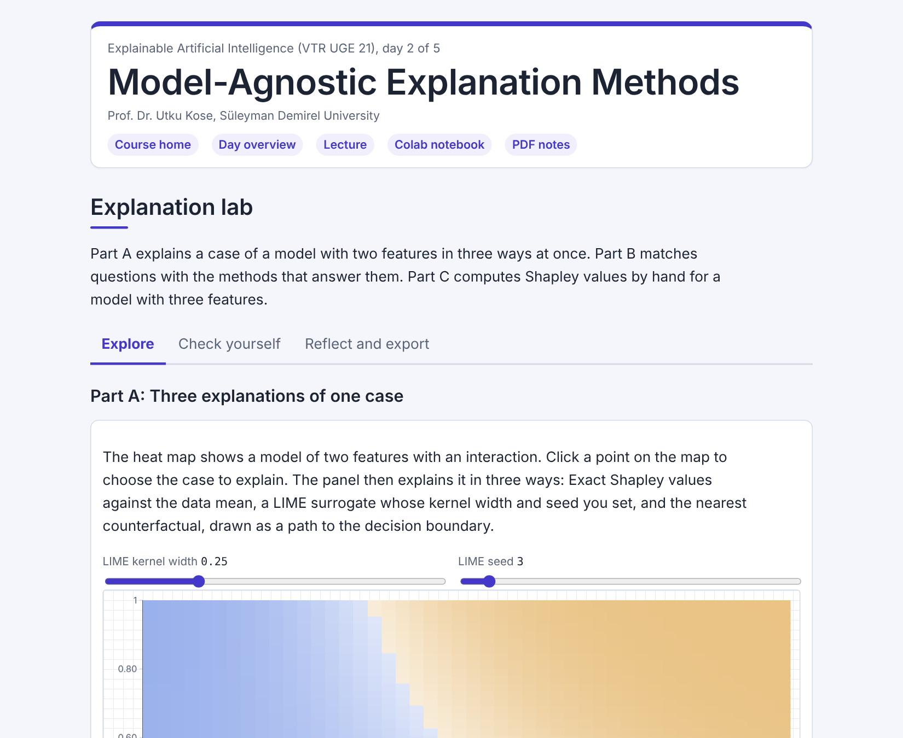

# Day 02: Model-Agnostic Explanation Methods

**Explainable Artificial Intelligence (VTR UGE 21)**  
Prof. Dr. Utku Kose, Süleyman Demirel University

   

Explaining any model from its predictions alone: which features matter, how they act, why one case got its prediction and what would change it. **Estimated study time:** 6 to 8 hours.

## Materials of the day

Each material has its own role. Start with the lecture page; the study path below gives the order and the time of each step.

| Material | What it holds | Open |
|---|---|---|
| Lecture page | The concepts of the day, with animations, knowledge checks, review cards and the references | [Lecture page](https://utkukose.github.io/xai-veltech-NB-lecture/days/day-02/lecture.html) |
| Colab notebook | Python step 2: NumPy arrays, randomness and functions, then the hands-on sections with exercises, an application switch and the application challenges |  |
| Interactive lab | Explanation lab: Three practice parts, a self-assessment and an exportable learning log | [Interactive lab](https://utkukose.github.io/xai-veltech-NB-lecture/days/day-02/lab.html) |
| PDF lecture notes | The lecture and the Python step in one printable file | [PDF notes](Day02_Lecture_Notes.pdf) |

<table><tr><td width="50%"> From the Colab notebook</td><td width="50%"> The interactive lab</td></tr></table>

## Learning outcomes

By the end of the day, students are expected to explain the idea of a model-agnostic explanation, to compute and read permutation importance, partial dependence and individual conditional expectation (ICE) curves, to explain one prediction with local interpretable model-agnostic explanations (LIME) and with Shapley additive explanations (SHAP) and compare the two, to state what a counterfactual and an anchor answer, and to choose a method for a given question. In Python, students are expected to use NumPy arrays, reproducible random numbers and functions that receive a model as an argument.

## Study path

| Step | Activity | Suggested time |
|---|---|---|
| 1 | Read the [lecture page](https://utkukose.github.io/xai-veltech-NB-lecture/days/day-02/lecture.html) and answer its knowledge checks | 1 hour 30 minutes |
| 2 | Work through parts A, B and C of the [interactive lab](https://utkukose.github.io/xai-veltech-NB-lecture/days/day-02/lab.html) | 45 minutes |
| 3 | Run Python step 2: NumPy arrays, randomness and functions in the [Colab notebook](https://colab.research.google.com/github/utkukose/xai-veltech-NB-lecture/blob/main/days/day-02/NB02_model_agnostic_methods.ipynb#scrollTo=python-step), right after the setup cell | 1 hour |
| 4 | Work through the numbered sections of the notebook and their exercises | 2 hours 30 minutes |
| 5 | Use the application switch of the notebook and solve the application challenge of your field | 45 minutes |
| 6 | Take the self-assessment in the [interactive lab](https://utkukose.github.io/xai-veltech-NB-lecture/days/day-02/lab.html) (tab: Check yourself) | 20 minutes |
| 7 | Write the reflection in the lab, export the learning log and complete the daily task below | 45 minutes |

## Live session plan

The day runs as one synchronous session in class or online, and each material has one role in it. The lecture page is on the screen, and at each orange Colab box the instructor shows the matching section in a copy of the notebook that has already been run. Students work in their own copy of the notebook from top to bottom, and each lab part follows the lecture part it practises. The PDF lecture notes serve reading after the session, and the study path above serves self-paced study.

| Time | Activity |
|---|---|
| 0:00 to 0:10 | Opening: Recap of Day 1 and the rule of the day: Only the prediction function is available. Students open the notebook in Colab, save a copy and run section 0 |
| 0:10 to 0:45 | Lecture page, part 1: A model that cannot be read, permutation importance and its correlation trap, partial dependence and ICE curves |
| 0:45 to 1:10 | Colab, together: Python step 2, ending with a permutation importance computed by hand |
| 1:10 to 1:20 | Break |
| 1:20 to 2:00 | Lecture page, part 2: LIME with the kernel-width animation, Shapley values with the ordering animation, counterfactuals and anchors, choosing a method; then lab Part B with the whole class |
| 2:00 to 2:40 | Colab, in pairs: Sections 1 to 6 with their exercises, then section 7 with a different field for each pair |
| 2:40 to 3:00 | Lab and closing: Part C by hand, Part A on three explanations of one case, then the self-assessment; after the session: The PDF notes, the daily task and the optional section 8 |

## Daily task and submission

Set the application switch to your field. Report the three most important features by permutation importance and by mean absolute SHAP value, explain one case with SHAP, and write about 200 words on whether the explanations agree with what an expert in your field would expect.

The task is optional and supports self-learning and a personal portfolio. During an active delivery of the course, it can be sent together with the exported learning log to utkukose@sdu.edu.tr or utkukose@gmail.com.

## Research and report assignment (optional)

**The disagreement problem in post-hoc explanation.** Review published studies that compare SHAP and LIME on the same models and data &#91;[9](https://utkukose.github.io/xai-veltech-NB-lecture/days/day-02/lecture.html#ref-9), [10](https://utkukose.github.io/xai-veltech-NB-lecture/days/day-02/lecture.html#ref-10)&#93;. Classify the reported disagreements by their cause: Perturbation distribution, value function, slope against contribution, or estimator variance. Conclude with a reporting protocol of no more than ten rules. The report should be about 1500 words with at least eight sources.
