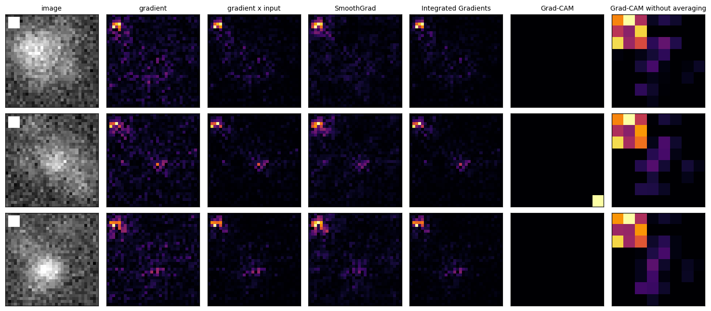
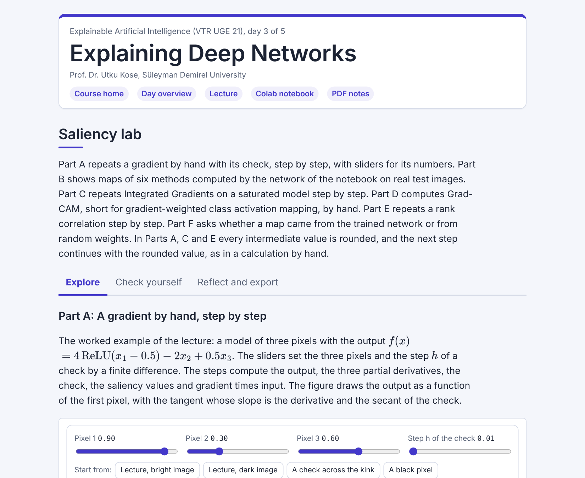

# Day 03: Explaining Deep Networks

**Explainable Artificial Intelligence (VTR UGE 21)**  
Prof. Dr. Utku Kose, Süleyman Demirel University

   

Where a network looks: gradients, SmoothGrad, Integrated Gradients and Grad-CAM (gradient-weighted class activation mapping), checked against a known truth and a sanity test, and geodesic explanations with GEMEX (Geodesic Entropic Manifold Explainability). **Estimated study time:** 6 to 8 hours.

## Materials of the day

Each material has its own role. Start with the lecture page; the study path below gives the order and the time of each step.

| Material | What it holds | Open |
|---|---|---|
| Lecture page | The concepts of the day, with animations, an interactive scene, knowledge checks, review cards and the references | [Lecture page](https://utkukose.github.io/xai-veltech-NB-lecture/days/day-03/lecture.html) |
| Colab notebook | Python step 3: A neural network as arrays and the chain rule, then the hands-on sections with exercises, an application switch and the application challenges |  |
| Interactive lab | Saliency lab: Six practice parts, a self-assessment and an exportable learning log | [Interactive lab](https://utkukose.github.io/xai-veltech-NB-lecture/days/day-03/lab.html) |
| PDF lecture notes | The Python step and the lecture in one printable file | [PDF notes](Day03_Lecture_Notes.pdf) |

<table><tr><td width="50%"> From the Colab notebook</td><td width="50%"> The interactive lab</td></tr></table>

## Learning outcomes

By the end of the day, students are expected to explain why the gradient of a network is an explanation, to compute and compare saliency, SmoothGrad, Integrated Gradients and Grad-CAM maps, to grade maps against a known ground truth and apply the model-randomisation sanity test, to read a GEMEX explanation with its uncertainty, and to detect a shortcut in images of their own field. In Python, students are expected to read a neural network as arrays and matrix products and to apply the chain rule.

## Study path

| Step | Activity | Suggested time |
|---|---|---|
| 1 | Read the [lecture page](https://utkukose.github.io/xai-veltech-NB-lecture/days/day-03/lecture.html) and answer its knowledge checks | 1 hour 30 minutes |
| 2 | Run Python step 3: A neural network as arrays and the chain rule in the [Colab notebook](https://colab.research.google.com/github/utkukose/xai-veltech-NB-lecture/blob/main/days/day-03/NB03_explaining_deep_networks.ipynb#scrollTo=python-step), right after the setup section | 1 hour |
| 3 | Work through parts A to F of the [interactive lab](https://utkukose.github.io/xai-veltech-NB-lecture/days/day-03/lab.html) | 1 hour |
| 4 | Work through the numbered sections of the notebook and their exercises | 2 hours 30 minutes |
| 5 | Use the application switch of the notebook and solve the application challenge of your field | 45 minutes |
| 6 | Take the self-assessment in the [interactive lab](https://utkukose.github.io/xai-veltech-NB-lecture/days/day-03/lab.html) (tab: Check yourself) | 20 minutes |
| 7 | Write the reflection in the lab, export the learning log and complete the daily task below | 45 minutes |

## Live session plan

The day runs as one synchronous session in class or online, and each material has one role in it. The lecture page is on the screen, and at each orange Colab box the instructor shows the matching section in a copy of the notebook that has already been run. Students work in their own copy of the notebook from top to bottom, and each lab part follows the lecture part it practises. The PDF lecture notes serve reading after the session, and the study path above serves self-paced study.

| Time | Activity |
|---|---|
| 0:00 to 0:10 | Opening: Recap of the lesion images and the shortcut that accuracy cannot see. Students open the notebook in Colab, save a copy and run section 0 |
| 0:10 to 0:45 | Lecture page, part 1: Looking inside a network, saliency, SmoothGrad and Integrated Gradients with the saturation animation |
| 0:45 to 1:10 | Colab, together: Python step 3, ending with gradient times input adding up to the output |
| 1:10 to 1:20 | Break |
| 1:20 to 1:55 | Lecture page, part 2: Grad-CAM with the averaging animation, grading the maps and the sanity test, GEMEX; then lab Part B on trained and random maps and Part D by hand |
| 1:55 to 2:40 | Colab, in pairs: Sections 1 to 6 with their exercises, then section 7 with a different field for each pair |
| 2:40 to 3:00 | Lab and closing: Part F with the whole class, then the self-assessment; after the session: The PDF notes, the daily task, the GEMEX playground and the optional section 8 |

## Daily task and submission

Set the application switch to your field. Report the accuracy of the network with and without the cue, show the Integrated Gradients maps of four images, state whether the maps reveal the cue, and write about 200 words on how you would detect and remove such a cue in real data from your field.

The task is optional and supports self-learning and a personal portfolio. During an active delivery of the course, it can be sent together with the exported learning log to utkukose@sdu.edu.tr or utkukose@gmail.com.

## Research and report assignment (optional)

**Evaluating saliency methods.** Review how saliency methods are evaluated: Ground-truth benchmarks, sanity checks and perturbation tests &#91;[3](https://utkukose.github.io/xai-veltech-NB-lecture/days/day-03/lecture.html#ref-3), [5](https://utkukose.github.io/xai-veltech-NB-lecture/days/day-03/lecture.html#ref-5), [9](https://utkukose.github.io/xai-veltech-NB-lecture/days/day-03/lecture.html#ref-9), [10](https://utkukose.github.io/xai-veltech-NB-lecture/days/day-03/lecture.html#ref-10)&#93;. Compare what each evaluation can and cannot establish. The report should be about 1500 words with at least eight sources.
