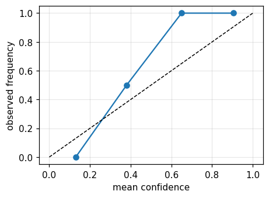
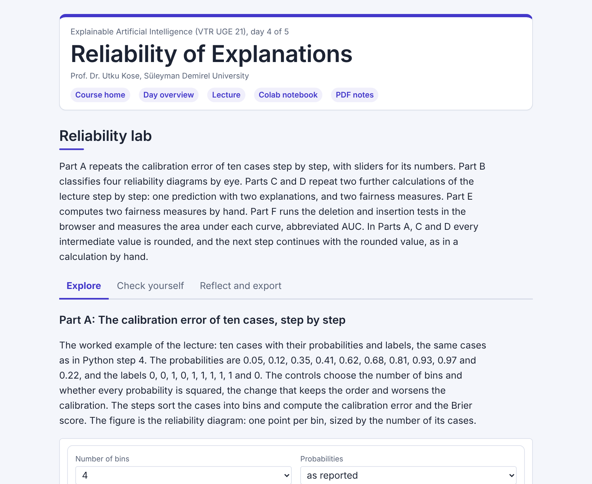

# Day 04: Reliability of Explanations

**Explainable Artificial Intelligence (VTR UGE 21)**  
Prof. Dr. Utku Kose, Süleyman Demirel University

   

When can a probability, an explanation and a decision be trusted? Calibration, shift, manipulated explanations, fairness and a benchmark against random. **Estimated study time:** 6 to 8 hours.

## Materials of the day

Each material has its own role. Start with the lecture page; the study path below gives the order and the time of each step.

| Material | What it holds | Open |
|---|---|---|
| Lecture page | The concepts of the day, with animations, an interactive scene, knowledge checks, review cards and the references | [Lecture page](https://utkukose.github.io/xai-veltech-NB-lecture/days/day-04/lecture.html) |
| Colab notebook | Python step 4: Data frames and plots, then the hands-on sections with exercises, an application switch and the application challenges |  |
| Interactive lab | Reliability lab: Six practice parts, a self-assessment and an exportable learning log | [Interactive lab](https://utkukose.github.io/xai-veltech-NB-lecture/days/day-04/lab.html) |
| PDF lecture notes | The Python step and the lecture in one printable file | [PDF notes](Day04_Lecture_Notes.pdf) |

<table><tr><td width="50%"> From the Colab notebook</td><td width="50%"> The interactive lab</td></tr></table>

## Learning outcomes

By the end of the day, students are expected to read a reliability diagram and the expected calibration error, to detect a shifted population with a domain classifier, to explain why a model can be confidently wrong under shift, to describe how an explanation can be manipulated while the prediction stays the same, to audit a model for group differences and find a proxy with SHAP (Shapley additive explanations), and to test an explanation method against a random baseline. In Python, students are expected to build, filter and group pandas data frames and draw plots from them.

## Study path

| Step | Activity | Suggested time |
|---|---|---|
| 1 | Read the [lecture page](https://utkukose.github.io/xai-veltech-NB-lecture/days/day-04/lecture.html) and answer its knowledge checks | 1 hour 30 minutes |
| 2 | Run Python step 4: Data frames and plots in the [Colab notebook](https://colab.research.google.com/github/utkukose/xai-veltech-NB-lecture/blob/main/days/day-04/NB04_reliability_of_explanations.ipynb#scrollTo=python-step), right after the setup section | 1 hour |
| 3 | Work through parts A to F of the [interactive lab](https://utkukose.github.io/xai-veltech-NB-lecture/days/day-04/lab.html) | 1 hour |
| 4 | Work through the numbered sections of the notebook and their exercises | 2 hours 30 minutes |
| 5 | Use the application switch of the notebook and solve the application challenge of your field | 45 minutes |
| 6 | Take the self-assessment in the [interactive lab](https://utkukose.github.io/xai-veltech-NB-lecture/days/day-04/lab.html) (tab: Check yourself) | 20 minutes |
| 7 | Write the reflection in the lab, export the learning log and complete the daily task below | 45 minutes |

## Live session plan

The day runs as one synchronous session in class or online, and each material has one role in it. The lecture page is on the screen, and at each orange Colab box the instructor shows the matching section in a copy of the notebook that has already been run. Students work in their own copy of the notebook from top to bottom, and each lab part follows the lecture part it practises. The PDF lecture notes serve reading after the session, and the study path above serves self-paced study.

| Time | Activity |
|---|---|
| 0:00 to 0:10 | Opening: Recap of Day 3 and the three questions of the day: The probability, the explanation and the decision. Students open the notebook in Colab, save a copy and run section 0 |
| 0:10 to 0:45 | Lecture page, part 1: Calibration with the reliability animation, shift and the three image slices; then lab Part B with the whole class |
| 0:45 to 1:10 | Colab, together: Python step 4, ending with a reliability table |
| 1:10 to 1:20 | Break |
| 1:20 to 1:55 | Lecture page, part 2: Manipulated explanations with the equal-prediction animation, fairness and proxies, the benchmark against random; then lab Part E by hand |
| 1:55 to 2:40 | Colab, in pairs: Sections 1 to 6 with their exercises, then section 7 with a different field for each pair |
| 2:40 to 3:00 | Lab and closing: Part F, the deletion and insertion tests, then the self-assessment; after the session: The PDF notes, the daily task and the optional section 8 |

## Daily task and submission

Run the benchmark of section 7 on the credit data instead of the tumour data, with the gradient-boosting model of section 2. Report the table, state whether every method beats the random ranking and write about 200 words on which method you would ship with the model, and why.

The task is optional and supports self-learning and a personal portfolio. During an active delivery of the course, it can be sent together with the exported learning log to utkukose@sdu.edu.tr or utkukose@gmail.com.

## Research and report assignment (optional)

**Evaluating the reliability of explanations.** Review the evidence on the fragility and manipulability of explanations and on benchmark suites for them &#91;[2](https://utkukose.github.io/xai-veltech-NB-lecture/days/day-04/lecture.html#ref-2), [3](https://utkukose.github.io/xai-veltech-NB-lecture/days/day-04/lecture.html#ref-3), [4](https://utkukose.github.io/xai-veltech-NB-lecture/days/day-04/lecture.html#ref-4), [12](https://utkukose.github.io/xai-veltech-NB-lecture/days/day-04/lecture.html#ref-12)&#93;. Propose a minimal set of tests that an explanation should pass before it is shown to a decision maker. The report should be about 1500 words with at least eight sources.
