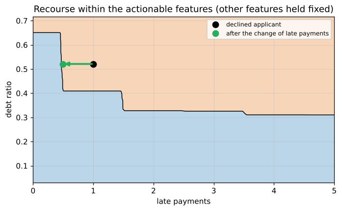
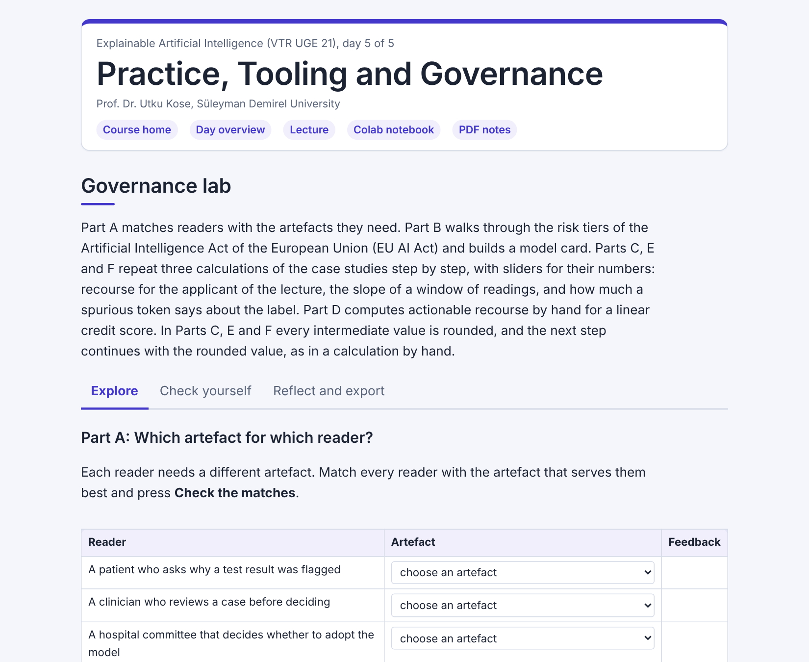

# Day 05: Practice, Tooling and Governance

**Explainable Artificial Intelligence (VTR UGE 21)**  
Prof. Dr. Utku Kose, Süleyman Demirel University

   

From explanations to artefacts that people use: records, dashboards, model cards, risk tiers, and three case studies from finance, maintenance and text. **Estimated study time:** 6 to 8 hours.

## Materials of the day

Each material has its own role. Start with the lecture page; the study path below gives the order and the time of each step.

| Material | What it holds | Open |
|---|---|---|
| Lecture page | The concepts of the day, with animations, an interactive scene, knowledge checks, review cards and the references | [Lecture page](https://utkukose.github.io/xai-veltech-NB-lecture/days/day-05/lecture.html) |
| Colab notebook | Python step 5: Classes, records and files, then the hands-on sections with exercises, an application switch and the application challenges |  |
| Interactive lab | Governance lab: Six practice parts, a self-assessment and an exportable learning log | [Interactive lab](https://utkukose.github.io/xai-veltech-NB-lecture/days/day-05/lab.html) |
| PDF lecture notes | The Python step and the lecture in one printable file | [PDF notes](Day05_Lecture_Notes.pdf) |

<table><tr><td width="50%"> From the Colab notebook</td><td width="50%"> The interactive lab</td></tr></table>

## Learning outcomes

By the end of the day, students are expected to create an explanation record with a fingerprint, to design a dashboard and a model card for a given reader, to place an application in the risk tiers of the Artificial Intelligence Act of the European Union (EU AI Act), to give actionable recourse that respects features that cannot change, to explain a maintenance model whose features are derived from signals, and to detect a spurious token in a text classifier. In Python, students are expected to use dataclasses, files in the JavaScript Object Notation (JSON) and hashes for reproducible records.

## Study path

| Step | Activity | Suggested time |
|---|---|---|
| 1 | Read the [lecture page](https://utkukose.github.io/xai-veltech-NB-lecture/days/day-05/lecture.html) and answer its knowledge checks | 1 hour 30 minutes |
| 2 | Run Python step 5: Classes, records and files in the [Colab notebook](https://colab.research.google.com/github/utkukose/xai-veltech-NB-lecture/blob/main/days/day-05/NB05_practice_tooling_governance.ipynb#scrollTo=python-step), right after the setup section | 1 hour |
| 3 | Work through parts A to F of the [interactive lab](https://utkukose.github.io/xai-veltech-NB-lecture/days/day-05/lab.html) | 1 hour |
| 4 | Work through the numbered sections of the notebook and their exercises | 2 hours 30 minutes |
| 5 | Use the application switch of the notebook and solve the application challenge of your field | 45 minutes |
| 6 | Take the self-assessment in the [interactive lab](https://utkukose.github.io/xai-veltech-NB-lecture/days/day-05/lab.html) (tab: Check yourself) | 20 minutes |
| 7 | Write the reflection in the lab, export the learning log and complete the daily task below | 45 minutes |

## Live session plan

The day runs as one synchronous session in class or online, and each material has one role in it. The lecture page is on the screen, and at each orange Colab box the instructor shows the matching section in a copy of the notebook that has already been run. Students work in their own copy of the notebook from top to bottom, and each lab part follows the lecture part it practises. The PDF lecture notes serve reading after the session, and the study path above serves self-paced study.

| Time | Activity |
|---|---|
| 0:00 to 0:10 | Opening: Who reads an explanation, and in which form? Students open the notebook in Colab, save a copy and run section 0 |
| 0:10 to 0:45 | Lecture page, part 1: Records and dashboards, model cards and datasheets, the General Data Protection Regulation (GDPR) and the EU AI Act; then lab Part A with the whole class and Part B on the risk tier and the model card of an application chosen by the class |
| 0:45 to 1:10 | Colab, together: Python step 5, ending with a record written to a file and read back |
| 1:10 to 1:20 | Break |
| 1:20 to 1:50 | Lecture page, part 2: Case study A with the recourse animation, case study B with the derived-feature animation, case study C; then lab Part D by hand |
| 1:50 to 2:30 | Colab, in pairs: Sections 1 to 7 with their exercises, then section 8 with a different field for each pair |
| 2:30 to 3:00 | Closing: Section 9 with the final project, questions and the course evaluation |

## Daily task and submission

Generate a model card for the credit model of case study A, including disaggregated performance for the two groups of the synthetic data, and write three recourse statements for three declined applicants. Disaggregated means computed separately for group A and for group B. Each statement must change only actionable features. Attach the explanation record of one statement with its digest.

The task is optional and supports self-learning and a personal portfolio. During an active delivery of the course, it can be sent together with the exported learning log to utkukose@sdu.edu.tr or utkukose@gmail.com.

## Research and report assignment (optional)

**Explanation obligations in practice.** Compare how two laws of the European Union address the explanation of automated decisions, the GDPR and the EU AI Act &#91;[3](https://utkukose.github.io/xai-veltech-NB-lecture/days/day-05/lecture.html#ref-3), [4](https://utkukose.github.io/xai-veltech-NB-lecture/days/day-05/lecture.html#ref-4)&#93;. Review how model cards and datasheets have been adopted since their proposal &#91;[1](https://utkukose.github.io/xai-veltech-NB-lecture/days/day-05/lecture.html#ref-1), [2](https://utkukose.github.io/xai-veltech-NB-lecture/days/day-05/lecture.html#ref-2)&#93;. Conclude with a checklist for a provider of a high-risk system. The report should be about 1500 words with at least eight sources.
